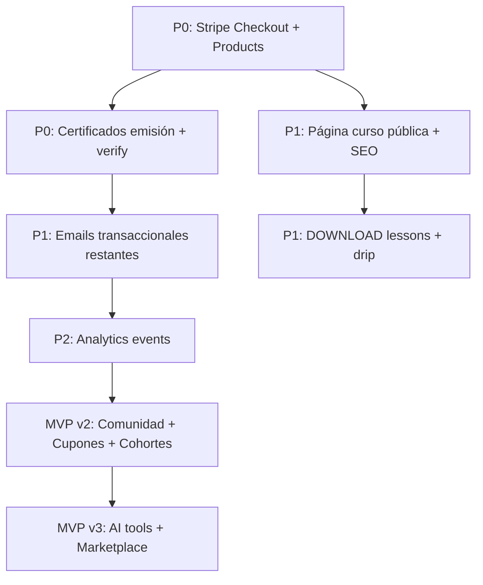

# soyup.work — TODO definitiva

> Auditoría cruzada con el código (`src/`, `prisma/schema.prisma`) y [full-features.md](./full-features.md).
> **Última actualización:** 2026-05-29

**Leyenda:** `[x]` hecho · `[~]` parcial · `[ ]` pendiente

---

## Resumen ejecutivo

| Área                                       | Estado       | Nota                                                       |
| ------------------------------------------ | ------------ | ---------------------------------------------------------- |
| Marketing & landing                        | 🟢 Fuerte    | Landing, FAQ, waitlist, newsletter, catálogo público       |
| Auth & dashboard alumno                    | 🟢 Fuerte    | Clerk, roles, progreso, quizzes, continue learning         |
| LMS admin & contenido                      | 🟢 Fuerte    | CRUD cursos/curriculum, Mux, quizzes, unlock secuencial    |
| Commerce                                   | 🔴 Crítico   | Webhooks Stripe sí; **no hay checkout ni productos en UI** |
| Certificados                               | 🔴 Crítico   | Schema + lista; **sin emisión, PDF ni verificación**       |
| Marketing público (SEO/rutas)              | 🟡 Medio     | Faltan blog, precios, sitemap, páginas curso públicas      |
| Comunidad / gamificación / cohortes reales | 🔴 Pendiente | Solo modelos Prisma                                        |
| Upwork AI & calculadoras                   | 🔴 Pendiente | Demo/marketing; sin herramientas productivas               |
| Analytics eventos                          | 🔴 Pendiente | Modelo `AnalyticsEvent` sin uso en app                     |
| Emails transaccionales                     | 🟡 Medio     | 3 templates; faltan welcome, certificado, etc.             |

**Conclusión:** El esqueleto MVP v1 está ~70% construido. Para lanzar comercialmente faltan sobre todo **checkout end-to-end**, **certificados reales** y **páginas públicas de curso + SEO**.

---

## ✅ Hecho (no requiere acción inmediata)

### 1. Marketing

- [x] Landing SEO con CTAs, hero, propuesta de valor, simulador propuesta (demo)
- [x] FAQ en landing (`marketing-faq-section`, constantes)
- [x] Waitlist con verificación email (Clerk + Resend)
- [x] Newsletter / captura leads en footer
- [x] Modo waitlist público (`PUBLIC_WAITLIST_MODE`)
- [x] Catálogo público + páginas por categoría
- [x] Meta tags y Open Graph en marketing/catálogo
- [x] Página demo / preview producto

### 2. Auth & usuarios

- [x] Sign-in / sign-up con Clerk
- [x] Webhooks Clerk → sync usuario en DB
- [x] Roles STUDENT / INSTRUCTOR / ADMIN
- [x] Protección rutas (`proxy.ts`, `requireAdmin`, `requireStudent`)
- [x] Dashboard alumno: inscritos, progreso, continue, certificados (lista)
- [x] Perfil básico (avatar, nombre, bio)

### 3. LMS

- [x] CRUD cursos (draft / published / archived), slugs, categorías, thumbnails R2
- [x] CRUD módulos y lecciones (video, texto, quiz)
- [x] Upload y playback video Mux + webhooks
- [x] Quizzes: single/multiple choice, intentos, passing score, resultados
- [x] Progreso por lección (mark complete, barras, % curso)
- [x] Unlock secuencial / lecciones preview / contenido bloqueado sin enrollment
- [x] Course landing interna (syllabus, reviews, CTA — sin checkout)
- [x] Generación syllabus con OpenAI (admin)

### 4. Admin

- [x] Panel admin: cursos, curriculum, categorías, usuarios, ventas, métricas
- [x] Settings: general, auth, email, pagos, storage, video, notificaciones
- [x] Reordenar módulos/lecciones (server actions, sin DnD)
- [x] Revenue charts y funnel básico
- [x] Maintenance / platform gates

### 5. Infraestructura

- [x] Verificación webhooks Stripe, Clerk, Mux
- [x] Idempotencia webhooks
- [x] R2 signed upload URLs (thumbnails)
- [x] Turnstile CAPTCHA
- [x] Rate limit en log ingest
- [x] Health check API

### 6. Emails (implementados)

- [x] Verificación waitlist
- [x] Verificación newsletter
- [x] Confirmación de compra (post-webhook Stripe)

---

## 🔥 MVP v1 — Cierre de brechas (prioridad lanzamiento)

> Objetivo: completar el MVP v1 definido en [full-features.md § MVP Prioridad Real](./full-features.md#mvp-prioridad-real).

### Commerce & enrollments (P0 — bloqueante)

- [ ] **Stripe Checkout:** server action o route que cree `checkout.sessions` con `Product`/`Price` de Stripe
- [ ] **Sincronizar productos:** al publicar curso, crear/actualizar `Product` en DB + precio en Stripe
- [ ] **CTA compra:** conectar "Inscribirme ahora" en `course-landing-view` → checkout (no solo link a lección)
- [ ] **Páginas success / cancel** post-checkout (`/checkout/success`, `/checkout/cancel`)
- [ ] **Enrollment manual (admin):** inscribir/revocar usuario en curso sin pago
- [ ] **Historial compras / suscripciones** en dashboard alumno
- [ ] Cupones: dejar para v2 salvo que sea requisito de lanzamiento

**Evidencia gap:** no hay `createCheckoutSession` ni `checkout.sessions.create` en `src/`.

### Certificados (P0)

- [ ] **Auto-emisión** al completar curso (100% lecciones o reglas configurables)
- [ ] **`prisma.certificate.create`** con código único verificable
- [ ] **Página pública** `/certificados/verificar/[code]`
- [ ] **PDF descargable** (generación server-side o servicio)
- [ ] Email "certificado emitido"
- [ ] Marcar `Enrollment` como `COMPLETED` con timestamp

**Evidencia gap:** solo `certificate.findMany` en dashboard; sin `certificate.create`.

### Páginas públicas & SEO (P1)

- [ ] **Ruta pública** `/cursos/[slug]` (o `/catalogo/[slug]`) sin auth — hoy el catálogo apunta a dashboard
- [ ] **`sitemap.ts`** dinámico (cursos publicados, categorías, marketing)
- [ ] **`robots.ts`** dinámico
- [ ] **JSON-LD** (Organization, Course, FAQPage en landing)
- [ ] Meta/OG por curso público (descripción, imagen, precio)
- [ ] Página **pricing** `/precios` (+ `/precios/empresas` si aplica)
- [ ] Rutas nav huérfanas: implementar o quitar del nav (`nav-data.ts`)

### LMS gaps MVP (P1)

- [ ] **Lecciones DOWNLOAD:** UI admin upload assets + UI alumno descarga con signed URLs R2
- [ ] **Drip content:** lógica `unlockAfterDays` / `unlockAt` (cron o evaluación en `get-course-page-data`)
- [ ] **Video progress:** persistir `watchedSeconds` / `lastPositionSec` desde Mux player
- [ ] **Resume playback** desde última posición
- [ ] Drag & drop reorder en curriculum admin (opcional si up/down basta para v1)

### Emails transaccionales MVP (P1)

- [ ] Welcome email (post sign-up o primer login)
- [ ] Enrollment confirmation (gratis o post-compra)
- [ ] Password recovery: delegado a Clerk — documentar o personalizar template Clerk
- [ ] Subscription update emails (activación, cancelación, past_due)

### Analytics mínimos MVP (P2)

- [ ] Pipeline `AnalyticsEvent`: helper `trackEvent()` + persistencia
- [ ] Eventos: `CHECKOUT_START`, `CHECKOUT_COMPLETE`, `LESSON_START`, `LESSON_COMPLETE`, `PAGE_VIEW`
- [ ] Instrumentar checkout y lecciones
- [ ] (Opcional v1) PostHog / Plausible / gtag según `.env`

### Perfil & onboarding (P2)

- [ ] Formulario perfil extendido: username, país, timezone, idioma, links sociales, skills, nivel, objetivos
- [ ] Flujo onboarding usando `onboardingDoneAt`
- [ ] Validación username único

### Seguridad & jobs MVP (P2)

- [ ] Cron o job runner (Vercel Cron, Inngest, etc.) para:
  - [ ] Drip unlocks programados
  - [ ] (Opcional) cola emails
- [ ] Signed URLs para **descarga** de assets (no solo upload)
- [ ] Rate limiting API públicas (además de log ingest)

---

## 🟡 MVP v2 — Comunidad, monetización avanzada, quizzes+

> Referencia: [full-features.md § MVP v2](./full-features.md#mvp-v2)

### Comunidad (Phase 2)

- [ ] Feed de comunidad (`CommunityPost`, comentarios, likes)
- [ ] Discusiones por curso (`CourseDiscussion`)
- [ ] Notificaciones in-app / email
- [ ] Menciones (@usuario)
- [ ] Rutas `/comunidad/foro`, `/comunidad/eventos`, `/comunidad/historias`
- [ ] Comentarios en video de lección (hoy: placeholder "Próximamente")

### Cohortes reales

- [ ] CRUD `Cohort` con fechas inicio/fin y estado
- [ ] `CohortEnrollment` vinculado a usuarios
- [ ] Reemplazar pseudo-cohortes (curso = cohorte) en admin
- [ ] Chat o canal por cohorte (integración externa o built-in)

### Gamificación

- [ ] XP, niveles, streaks (`UserGamification`)
- [ ] Badges (`Badge`, `UserBadge`)
- [ ] Leaderboards

### Commerce avanzado

- [ ] Cupones: CRUD admin + aplicar en checkout (`Coupon`)
- [ ] Bundles (`ProductBundleItem`)
- [ ] Múltiples precios por curso (lifetime vs mensual)
- [ ] Launch discounts
- [ ] Refunds manuales desde admin
- [ ] MRR / churn en dashboard ventas

### Quizzes avanzados

- [ ] Question banks
- [ ] Randomización de preguntas
- [ ] Timers con enforcement server-side
- [ ] Exámenes finales por curso

### Afiliados

- [ ] Referral tracking (`Affiliate`, `AffiliateReferral`)
- [ ] Dashboard afiliado
- [ ] Comisiones y payouts

### Blog & contenido

- [ ] CRUD blog admin (`BlogPost`)
- [ ] Rutas públicas `/recursos/blog`, `/recursos/blog/[slug]`
- [ ] Guías y plantillas (`/recursos/guias`, `/recursos/plantillas`)

### CRM & email marketing

- [ ] Lead management UI (`Lead`)
- [ ] Secuencias email (`EmailSequence`) + runner
- [ ] Broadcast emails
- [ ] Abandoned checkout emails

### Admin analytics v2

- [ ] Retención estudiantes
- [ ] Completion rate por curso
- [ ] Watch time agregado
- [ ] Drop-off por lección
- [ ] Top performing lessons

---

## 🔮 MVP v3 / Futuro

> Referencia: [full-features.md § MVP v3 y § 13](./full-features.md#mvp-v3)

### Upwork AI & herramientas

- [ ] Proposal generator (productivo, no demo estático)
- [ ] Proposal reviewer
- [ ] Profile analyzer
- [ ] Connect ROI / bidding calculator
- [ ] Freelance income calculator
- [ ] Tax estimation
- [ ] Cover letter optimizer
- [ ] Interview simulator
- [ ] AI panel en lecciones (hoy: "Próximamente")

### Marketplace & multi-instructor

- [ ] Portal instructor (rol INSTRUCTOR con permisos)
- [ ] Perfiles públicos instructor
- [ ] Revenue split
- [ ] Múltiples instructores por curso

### AI Layer educativo

- [ ] AI mentor
- [ ] Resúmenes de lección
- [ ] Rutas de aprendizaje personalizadas

### Live learning

- [ ] Clases en vivo / webinars
- [ ] Office hours
- [ ] Integración calendario

### Enterprise

- [ ] Cuentas organización
- [ ] Team access y analytics

### Mobile & PWA

- [ ] PWA installable
- [ ] Offline mode
- [ ] Push notifications

### Video avanzado

- [ ] Signed playback tokens (`videoSignedPlayback` en settings)
- [ ] Captions/subtitles workflow
- [ ] Watermarking
- [ ] Bunny Stream (alternativa a Mux) — solo si se requiere

---

## 🛠 Deuda técnica & schema ahead of code

Modelos en Prisma **sin implementación en app** — implementar o podar si no van en roadmap:

| Modelo / enum                         | En schema | En app                |
| ------------------------------------- | --------- | --------------------- |
| `BlogPost`                            | ✅        | ❌                    |
| `Coupon`                              | ✅        | ❌                    |
| `Product` / `ProductBundleItem`       | ✅        | ❌ UI                 |
| `AnalyticsEvent`                      | ✅        | ❌                    |
| `CommunityPost` / `Comment` / `Like`  | ✅        | ❌                    |
| `CourseDiscussion`                    | ✅        | ❌                    |
| `Cohort` / `CohortEnrollment`         | ✅        | ❌ (admin usa proxy)  |
| `UserGamification` / `Badge`          | ✅        | ❌                    |
| `Affiliate` / `AffiliateReferral`     | ✅        | ❌                    |
| `EmailSequence` / `Lead` (CRM)        | ✅        | ❌                    |
| `LessonAsset` + `LessonType.DOWNLOAD` | ✅        | ❌ UI                 |
| `Tag` / `CourseTag`                   | ✅        | ❌ admin UI           |
| `suspendedAt` / `bannedAt`            | ✅        | ❌ (solo `deletedAt`) |

**Tareas transversales:**

- [ ] Dark mode (mencionado en features; verificar alcance UI)
- [ ] Tests E2E flujo compra → enrollment → certificado
- [ ] Documentar variables env nuevas en `.env.example` al implementar cada bloque
- [ ] Alinear `docs/db-schema.md` tras cambios de negocio

---

## Orden de ejecución recomendado

| Sprint        | Entregables                                                   | Impacto                        |
| ------------- | ------------------------------------------------------------- | ------------------------------ |
| **Sprint 1**  | Checkout, productos Stripe, success/cancel, CTA compra        | Monetización                   |
| **Sprint 2**  | Certificados auto + verify + PDF + enrollment COMPLETED       | Valor percibido / credibilidad |
| **Sprint 3**  | Curso público, sitemap, robots, JSON-LD, /precios             | SEO + conversión               |
| **Sprint 4**  | Manual enroll, emails welcome/enrollment, analytics básicos   | Operaciones + datos            |
| **Sprint 5+** | MVP v2 según prioridad negocio (comunidad vs cupones vs blog) | Retención + growth             |

---

## Checklist rápida pre-lanzamiento

- [ ] Usuario puede comprar curso con tarjeta y quedar inscrito automáticamente
- [ ] Usuario puede completar curso y recibir certificado verificable
- [ ] Curso publicado es indexable (URL pública + sitemap)
- [ ] Admin puede inscribir usuario manualmente
- [ ] Webhooks Stripe/Clerk/Mux probados en staging
- [ ] Emails críticos (compra, welcome) funcionan
- [ ] Modo waitlist desactivable para go-live (`PUBLIC_WAITLIST_MODE=false`)
- [ ] `.env` producción documentado

---

## Referencias en el repo

| Tema            | Archivos clave                                                         |
| --------------- | ---------------------------------------------------------------------- |
| Features spec   | `docs/full-features.md`                                                |
| Schema DB       | `prisma/schema.prisma`, `docs/db-schema.md`                            |
| Admin spec      | `docs/admin-ui-spec.md`                                                |
| Marketing       | `src/app/(marketing)/page.tsx`, `src/constants/marketing.constants.ts` |
| Stripe webhooks | `src/app/api/webhooks/stripe/`, `src/lib/webhooks/handlers/stripe/`    |
| Curso alumno    | `src/lib/course/get-course-page-data.ts`                               |
| Nav huérfano    | `src/data/nav-data.ts`                                                 |
| Waitlist        | `src/lib/platform/public-waitlist-mode.ts`                             |

---

_Mantener este archivo actualizado al cerrar cada ítem. Marcar `[x]` solo cuando esté en producción o mergeado a `main` con pruebas manuales documentadas._
