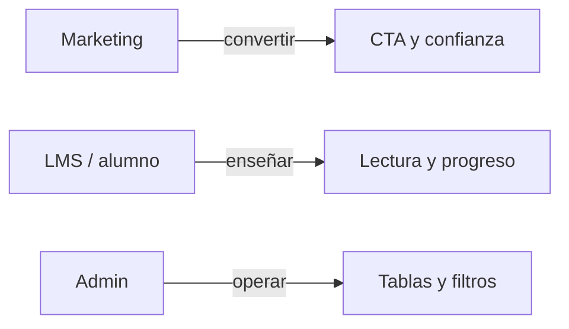
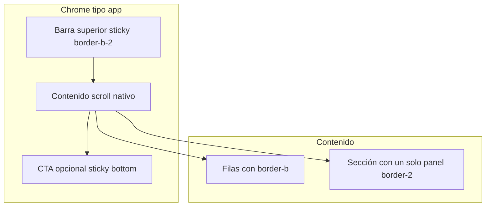

# Sistema de diseño UI — soyup.work

Guía maestra del lenguaje visual **neobrutalista** de soyup.work. Define principios, tokens, patrones y límites para marketing, app de alumno y plataforma en general.

> **Alcance:** este documento es transversal. Para pantallas del panel de administración (layout, toolbar, tabla/tarjetas), la fuente de verdad operativa sigue siendo [admin-ui-spec.md](./admin-ui-spec.md).

---

## 1. Introducción y alcance

### Qué es soyup.work (contexto de diseño)

soyup.work es una academia práctica para freelancers de **Upwork en Latinoamérica**: propuestas, Connects, pricing, entrevistas en inglés y operación freelance. El producto prioriza criterio comercial sobre tutoriales superficiales. Ver [briefing-materials.md](./briefing-materials.md) y [keywords.md](./keywords.md) para posicionamiento y tono de copy.

### Stack UI

| Capa             | Elección                                  |
| ---------------- | ----------------------------------------- |
| Framework        | Next.js App Router + React + TypeScript   |
| Estilos          | Tailwind CSS v4                           |
| Componentes base | shadcn/ui (Radix)                         |
| Tipografía       | Geist Sans (`next/font`)                  |
| Tokens           | CSS variables en `src/app/globals.css`    |
| Variantes        | `class-variance-authority` (ej. `Button`) |

### Documentación relacionada

| Documento                                        | Relación con UI                                   |
| ------------------------------------------------ | ------------------------------------------------- |
| [admin-ui-spec.md](./admin-ui-spec.md)           | Patrones de pantalla del admin (no duplicar aquí) |
| [briefing-materials.md](./briefing-materials.md) | Estrategia de producto y marca                    |
| [keywords.md](./keywords.md)                     | Tono SEO y vocabulario LATAM                      |
| [full-features.md](./full-features.md)           | Superficies que el diseño debe cubrir             |
| [db-schema.md](./db-schema.md)                   | Modelo de datos (la UI no lo redefine)            |
| [env.example.md](./env.example.md)               | Integraciones (Clerk usa bridge en `globals.css`) |

---

## 2. Fundamentos: brutalismo web y neobrutalismo

### Brutalismo web (enfoque clásico)

El término proviene del francés _béton brut_ (“hormigón en bruto”). En arquitectura, el brutalismo expone materiales y estructura sin disfrazarlos. En la web, el equivalente no son “tags HTML crudos”, sino **priorizar el contenido y al visitante** por encima del adorno.

Según [Brutalist Web Design](https://www.brutalist-web.design/), un sitio brutalista:

- Trata el contenido como material principal (texto, imágenes, audio), no el framework.
- Es honesto sobre qué es una web: hipertexto con enlaces y formularios, no una app disfrazada.
- Mantiene interacciones transparentes: solo enlaces y botones responden a clics; los botones se ven como botones.
- Respeta scroll nativo, el botón atrás del navegador y el rendimiento.
- Aplica estilo solo para resolver un problema concreto (“texto negro alineado a la izquierda sobre blanco, y decorar cuando haga falta”).

### Neobrutalismo (evolución digital)

El **neobrutalismo** (o _neubrutalism_) retoma la crudeza gráfica del brutalismo — bordes gruesos, sombras duras, tipografía assertiva, paletas de alto contraste — pero lo combina con **estándares UX actuales**: navegación clara, jerarquía legible, accesibilidad razonable y componentes reconocibles.

Referencias útiles:

- [Neubrutalism — The Definitive Guide](https://neubrutalism.com/)
- [Neobrutalism: Definition and Best Practices — NN/g](https://www.nngroup.com/articles/neobrutalism/)
- [Brutalism in Web Design — TodayMade](https://www.todaymade.com/blog/brutalist-web-design)

Señales visuales típicas del neobrutalismo:

| Señal           | Descripción                                                                    |
| --------------- | ------------------------------------------------------------------------------ |
| Bordes gruesos  | Contornos de 2–4px que delimitan cards, inputs y botones                       |
| Sombras offset  | `box-shadow` sin blur, desplazamiento fijo (efecto “estampado”)                |
| Tipografía dual | Display grande + cuerpo calmado y legible                                      |
| Color plano     | Pocos colores saturados; evitar gradientes suaves omnipresentes                |
| Layout con grid | Estructura subyacente visible; asimetría controlada (“roto pero no aleatorio”) |

### Comparativa rápida

| Aspecto     | Brutalismo web clásico              | Neobrutalismo (soyup.work)        | Minimalismo SaaS típico     |
| ----------- | ----------------------------------- | --------------------------------- | --------------------------- |
| Objetivo    | Contenido crudo, verdad al medio    | Impacto + usabilidad              | Pulido neutro               |
| Bordes      | A veces ausentes o HTML puro        | 2px+ siempre en componentes clave | 1px suaves o ninguno        |
| Sombras     | Ninguna o mínimas                   | Offset duras, sin blur            | Difusas, baja opacidad      |
| Tipografía  | Sistema o subrayado clásico         | Display bold + labels uppercase   | Sans geométrica ligera      |
| Interacción | Enlaces subrayados, botones nativos | Botones con “press” y sombra      | Hover sutil, rounded-full   |
| Riesgo      | Ilegible o anti-UX                  | Saturación visual                 | Homogeneidad / aburrimiento |

### Principios adoptados por soyup.work

1. **Contenido y conversión primero** — especialmente en marketing y landings SEO.
2. **Honestidad visual** — CTAs claros; sin patrones oscuros que confundan clic con lectura.
3. **Neobrutalismo consistente** — bordes 2px, sombras offset y tipografía jerárquica en toda la plataforma.
4. **Intensidad por superficie** — marketing y admin más expresivos; lecciones largas más calmadas.
5. **Tokens centralizados** — colores y radios en `globals.css`; patrones admin en `src/lib/admin/styles.ts`.
6. **Componentes reutilizables** — `Button`, `Badge`, paneles con clases compartidas antes que estilos ad hoc.
7. **Rendimiento** — decoración SVG/CSS ligera; evitar assets pesados innecesarios.
8. **Accesibilidad como límite** — el estilo no justifica bajo contraste ni targets diminutos.

---

## 3. Filosofía de diseño soyup.work

### Por qué neobrutalismo encaja con la marca

- **Diferenciación:** la mayoría de LMS y cursos online usan UI pulida, gradientes y cards flotantes suaves. soyup.work se percibe como academia directa, no como “otro curso genérico”.
- **Jerarquía para negocio:** eyebrows, tablas comparativas y badges guían la lectura hacia propuestas, Connects y pricing — temas del briefing.
- **Coherencia técnica:** Tailwind + shadcn permiten codificar bordes y sombras como utilidades repetibles (`shadow-[4px_4px_0px_0px_var(--foreground)]`).
- **Alineación con el copy:** mensajes como “aprende a facturar, no solo a registrarte” encajan con el brutalismo de **no vender humo** ([brutalist-web.design](https://www.brutalist-web.design/)).

### Tres modos de la interfaz



| Modo                   | Objetivo UX                       | Intensidad visual                        |
| ---------------------- | --------------------------------- | ---------------------------------------- |
| Marketing              | Captar leads, explicar valor, SEO | Alta                                     |
| LMS / dashboard alumno | Aprender sin fatiga               | Media (baja en bloques de lectura larga) |
| Admin                  | Gestionar datos con densidad      | Alta + compacta                          |

### Honestidad y copy

- CTAs describen la acción real (“Unirme a la lista”, “Ver demo del curso”).
- No prometer ingresos mágicos; el diseño refuerza credibilidad con estructura clara, no con efectos llamativos vacíos.
- Textos de interfaz en **español LATAM**; tono operacional en admin, persuasivo pero directo en marketing.
- Constantes de copy en `src/constants/marketing.constants.ts`; vocabulario SEO en [keywords.md](./keywords.md).

### Expresión controlada

Subir intensidad (sombras grandes, decoración flotante, uppercase agresivo) cuando:

- Es landing, hero, pricing o comparativa.
- Es panel admin con KPIs y listados.

Bajar intensidad cuando:

- El usuario lee lecciones largas, transcripciones o quizzes extensos.
- El contenido educativo es el foco (bordes `border-foreground/10`, menos sombra).

---

## 4. Tokens y fundamento técnico

Fuente de verdad: [`src/app/globals.css`](../src/app/globals.css).

### Colores semánticos (modo claro `:root`)

| Token                            | Valor (oklch)                | Uso                                       |
| -------------------------------- | ---------------------------- | ----------------------------------------- |
| `--background`                   | `oklch(1 0 0)`               | Fondo de página                           |
| `--foreground`                   | `oklch(0.153 0.006 107.1)`   | Texto principal, bordes brutalistas       |
| `--primary`                      | `oklch(0.527 0.154 150.069)` | Marca (verde), CTAs, acentos positivos    |
| `--primary-foreground`           | `oklch(0.982 0.018 155.826)` | Texto sobre primary                       |
| `--secondary`                    | `oklch(0.967 0.001 286.375)` | Superficies suaves, chips                 |
| `--muted` / `--muted-foreground` | fondo / texto secundario     | Descripciones, metadata                   |
| `--destructive`                  | `oklch(0.577 0.245 27.325)`  | Errores, columna “antes” en comparativas  |
| `--card`                         | `oklch(1 0 0)`               | Fondo de tarjetas                         |
| `--border`                       | `oklch(0.93 0.007 106.5)`    | Bordes sutiles (grilla, divisores tenues) |

Modo oscuro (`.dark`): mismos roles; `--primary` pasa a `oklch(0.448 0.119 151.328)`; fondos oscuros en `--background` y `--card`.

### Decoración flotante (marketing)

Variables para formas SVG en `NeobrutalistPageDecoration`:

| Token (light)           | Hex aprox. | Forma     |
| ----------------------- | ---------- | --------- |
| `--decoration-star`     | `#fde047`  | Estrella  |
| `--decoration-circle`   | `#6ee7b7`  | Círculo   |
| `--decoration-plus`     | `#c7d2fe`  | Cruz      |
| `--decoration-triangle` | `#fbcfe8`  | Triángulo |

En `.dark` se usan tonos más saturados (`#ca8a04`, `#059669`, etc.).

### Tipografía

En `@theme inline`, las tres familias apuntan a **Geist Sans**:

```css
--font-sans: var(--font-geist-sans), ui-sans-serif, system-ui, sans-serif;
--font-mono:
  var(--font-geist-sans), ...; /* labels “mono” = misma familia, estilo mono */
--font-heading: var(--font-geist-sans), ...;
```

| Rol               | Clases habituales                                                  | Uso                                |
| ----------------- | ------------------------------------------------------------------ | ---------------------------------- |
| Display / títulos | `font-heading`, `font-black`, `tracking-tight`                     | H1 hero, títulos de sección        |
| Labels operativos | `font-mono`, `uppercase`, `tracking-wider`, `text-[9px]`–`text-xs` | Eyebrows, headers de tabla, badges |
| Cuerpo            | `font-sans`, `text-muted-foreground`                               | Párrafos, descripciones            |

### Radio y espaciado

- `--radius: 0.875rem` (14px base).
- Derivados: `--radius-sm` … `--radius-4xl` vía multiplicadores en `@theme`.
- Cards de marketing suelen usar `rounded-2xl` o `rounded-3xl` además del radio del sistema.

### Sombras brutalistas (escala)

Patrón: `shadow-[Xpx_Xpx_0px_0px_var(--color)]` — **sin blur**.

| Nivel             | Offset                  | Contexto                                |
| ----------------- | ----------------------- | --------------------------------------- |
| Control pequeño   | `2px 2px`               | Botones default, inputs admin, logo nav |
| Card estándar     | `4px 4px`               | Tarjetas marketing, `adminPanelClass`   |
| Card hover        | `6px 6px`               | Hover en grids de valor / stats         |
| Hero / CTA grande | `8px 8px` – `12px 12px` | Bloques finales de landing              |

Color de sombra: casi siempre `var(--foreground)`; variantes semánticas usan `var(--primary)` o `var(--destructive)`.

### Bordes

| Patrón            | Clases                         | Uso                                        |
| ----------------- | ------------------------------ | ------------------------------------------ |
| Contorno estándar | `border-2 border-foreground`   | Cards, botones, nav                        |
| Sección fuerte    | `border-b-4 border-foreground` | Cierre de header admin                     |
| Divisor suave     | `border border-foreground/10`  | Acordeones de syllabus, bloques de lectura |
| Sección marketing | `border-y-2 border-foreground` | Bandas full-width                          |

### Interacción “press” (botones)

Definido en [`src/components/ui/button.tsx`](../src/components/ui/button.tsx):

```ts
const neoBrutalPress =
  "hover:translate-x-px hover:translate-y-px active:translate-y-[3px] active:shadow-none";
```

Al hover: el elemento se desplaza 1px simulando acercamiento a la sombra. Al active: cae 3px y la sombra desaparece (efecto de botón físico).

### Patrón canónico de panel (admin)

[`src/lib/admin/styles.ts`](../src/lib/admin/styles.ts):

```ts
export const adminPanelClass = cn(
  "border-2 border-foreground bg-card rounded-lg",
  "shadow-[4px_4px_0px_0px_var(--foreground)]",
);
```

Otros tokens admin: `adminEyebrowClass`, `adminInputClass`, `adminGridBackgroundClass`, `adminStatCardClass` (hover con sombra 6px).

### Bridge Clerk

Variables `--clerk-color-*` y `--clerk-border-radius` en `globals.css` alinean auth embebido con `--primary` y `--card`. Ver [env.example.md](./env.example.md).

---

## 5. Superficies del producto

### Matriz de intensidad

| Superficie           | Intensidad              | Archivos de referencia                                                                                                                                                                         |
| -------------------- | ----------------------- | ---------------------------------------------------------------------------------------------------------------------------------------------------------------------------------------------- |
| **Marketing**        | Alta                    | `src/app/(marketing)/page.tsx`, `src/components/marketing/marketing-hero-section.client.tsx`, `src/components/marketing-nav/`, `src/components/common/neobrutalist-page-decoration.client.tsx` |
| **Dashboard alumno** | Media                   | `src/components/dashboard/dashboard-shell.tsx`, `src/app/dashboard/courses/page.tsx`                                                                                                           |
| **LMS / lección**    | Media–baja en contenido | `src/components/course/course-learn-shell.tsx`, `src/components/course/course-landing-syllabus.tsx`                                                                                            |
| **Admin**            | Alta + densa            | Ver [admin-ui-spec.md](./admin-ui-spec.md), `src/components/admin/*`, `src/lib/admin/styles.ts`                                                                                                |

### Cuándo subir o bajar intensidad

```
Alta  ████████████████████  Marketing hero, comparativas, CTA final, admin KPIs
Media ██████████░░░░░░░░░░  Dashboard cursos, nav autenticado, footers
Baja  ████░░░░░░░░░░░░░░░░  Cuerpo de lección, texto largo, formularios internos densos
```

**Subir:** sombra 4–12px, `border-2`, uppercase en labels, decoración SVG de fondo, tablas comparativas con columnas semantic (destructive vs primary).

**Bajar:** `border-foreground/10`, sin sombra offset, párrafos `text-base`/`prose`, menos animación.

### Marketing (detalle)

- `NeobrutalistPageDecoration`: formas flotantes con sombra SVG offset; usar en landings públicas, no saturar admin.
- Hero: grilla de fondo sutil + radial `--primary` al 15% de opacidad.
- Secciones tipo “comparemos enfoques”: tabla desktop con headers `font-mono uppercase`; cards móvil con dos columnas de contraste.
- Nav sticky: `border-b-2`, logo con “sello” (`shadow-[2px_2px_0px_0px_var(--foreground)]`).

### LMS y alumno

- Shell de aprendizaje mantiene bordes fuertes en chrome (header móvil `border-b-2`).
- Contenido del syllabus puede usar bordes tenues para no competir con el video/texto.
- Progreso y footer de lección: paneles con `border-2` cuando la acción es primaria (marcar completada).

### Admin (resumen)

El admin comparte tokens globales pero añade densidad operativa: grillas de fondo, doble vista tabla/tarjetas, toolbars con filtros. **No repetir** aquí el checklist de pantallas; seguir [admin-ui-spec.md](./admin-ui-spec.md).

En viewports móviles, aplicar además las reglas de la [sección 6](#6-adaptabilidad-mobile-ui-tipo-app).

---

## 6. Adaptabilidad mobile (UI tipo app)

### Principio: mobile no es desktop encogido

En pantallas `< md` (~768px) no basta con reducir padding o apilar las mismas cards de escritorio. La UI móvil de soyup.work debe sentirse como una **aplicación nativa** (referencia principal: patrones **Android / Material** — listas densas, filas táctiles, navegación en zona del pulgar), no como un sitio marketing comprimido.

Mantenemos el lenguaje **neobrutalista** (bordes definidos, contraste, tipografía clara), pero con **escala compacta**: elementos más pequeños, menos sombra, menos anidación y más **filas y columnas** que tarjetas apiladas.

Referencias UX/UI web (React / Next.js / shadcn):

- [From Web to Native with React — Expo](https://expo.dev/blog/from-web-to-native-with-react) — listas tipo `FlatList`, densidad, no renderizar listas largas como `map` sin virtualizar cuando hay cientos de ítems.
- [Material Design — Layout](https://m3.material.io/foundations/layout/applying-layout) — rejilla, márgenes y comportamiento en pantallas estrechas.
- [shadcn/ui — Sheet](https://ui.shadcn.com/docs/components/sheet) / [Drawer](https://ui.shadcn.com/docs/components/drawer) — paneles laterales e inferiores al estilo app.
- [WCAG 2.2 — Target Size](https://www.w3.org/WAI/WCAG22/Understanding/target-size-minimum.html) — objetivos táctiles mínimos (~24×24px con excepciones; en práctica **44–48px** para controles principales).

### Desktop vs mobile: dos layouts, no uno responsive perezoso

| Enfoque        | Descripción                                                                | En soyup.work                                                                    |
| -------------- | -------------------------------------------------------------------------- | -------------------------------------------------------------------------------- |
| **Incorrecto** | Misma card desktop con `p-8`, sombra 8px y grid 3 columnas → `grid-cols-1` | Cards gigantes, mucho scroll, “matryoshka” visual                                |
| **Correcto**   | Componentes o markup distintos por breakpoint                              | `md:hidden` / `hidden md:block`, filas compactas en móvil, tabla solo en desktop |

Ejemplo en código: la comparativa de estrategias en `src/app/(marketing)/page.tsx` — en móvil (`md:hidden`) usa **filas con bloques planos**; en desktop (`hidden md:block`) usa **tabla** con sombra 8px. No es la misma estructura reducida.

```tsx
{
  /* Móvil: lista vertical, sin card contenedora pesada */
}
<div className="space-y-4 md:hidden">…</div>;

{
  /* Desktop: tabla dentro de una card */
}
<div className="hidden md:block rounded-2xl border-2 … shadow-[8px_8px_0px_0px_var(--foreground)]">
  <table>…</table>
</div>;
```

### Reglas de composición mobile

1. **Prohibido: card dentro de card** en móvil. Si un bloque ya es una card con borde 2px y sombra, el contenido interior debe ser **filas, divisores o celdas planas** (`border-b`, `bg-* /10`), no otra card `rounded-2xl` con sombra propia.
2. **Preferir filas (list rows)** para listados, catálogos, comparativas y menús: una fila = un `border-b-2` o contenedor plano + icono/texto/meta alineados en flex/grid.
3. **Columnas solo cuando aporten**: 2 columnas máximo en móvil (ej. icono + texto, label + valor). Evitar grids de 3–4 cards iguales al desktop.
4. **Una acción primaria por viewport** cuando sea flujo de conversión; CTA sticky inferior con `pb-safe` / `env(safe-area-inset-bottom)` si se fija al borde.
5. **Decoración mínima** en `< md`: reducir o desactivar `NeobrutalistPageDecoration` si compite con contenido; hero más bajo (`py-12` vs `py-28`).

### Escala visual mobile (neobrutalismo compacto)

Misma gramática visual, **menor magnitud**:

| Elemento         | Desktop (referencia)  | Mobile (objetivo)                                              |
| ---------------- | --------------------- | -------------------------------------------------------------- |
| Sombra card      | `4px`–`8px` offset    | `2px` o sin sombra en filas; `4px` máx. en card principal      |
| Padding card     | `p-6`–`p-8`           | `p-3`–`p-4`                                                    |
| Título sección   | `text-4xl`–`text-5xl` | `text-xl`–`text-2xl`                                           |
| Eyebrow / label  | `text-[10px]`         | `text-[9px]`                                                   |
| Botón primario   | `size="lg"` (`h-12`)  | `size="default"` o `sm` (`h-9` / `h-8`)                        |
| Icono en fila    | `size-5`–`size-6`     | `size-4`–`size-5`                                              |
| Borde contenedor | `border-2` en shell   | `border-b` entre filas; `border-2` solo en contenedor exterior |

Los targets táctiles pueden ser **más altos que el texto** (min `min-h-11` / 44px en la fila entera clickable) sin inflar la tipografía.

### Patrones de layout mobile



| Patrón                  | Uso                                     | Implementación (shadcn / Tailwind)                                        |
| ----------------------- | --------------------------------------- | ------------------------------------------------------------------------- |
| **List row**            | Cursos, ítems de menú, comparativas     | `flex items-center gap-3 min-h-11 border-b-2 border-foreground px-3 py-2` |
| **Section panel**       | Un bloque por sección (no anidar cards) | Un solo `border-2 rounded-xl` + filas internas sin sombra                 |
| **Sheet lateral**       | Menú marketing, filtros                 | `Sheet` + `SheetContent side="right"` — ver `mobile-nav.tsx`              |
| **Drawer inferior**     | Acciones contextuales, filtros rápidos  | `Drawer` (shadcn) en flujos app                                           |
| **Bottom bar** (futuro) | 3–5 destinos en app alumno              | `fixed bottom-0 … pb-safe md:hidden` + sidebar en `md:`                   |
| **Tabla → lista**       | Datos tabulares                         | `hidden md:table` / `md:hidden` con filas label-valor                     |

### Navegación y chrome

- **Marketing:** hamburger + `Sheet` (`src/components/marketing-nav/mobile-nav.tsx`), no mega-menú horizontal.
- **App / dashboard:** priorizar barra superior compacta; en roadmap, barra inferior en móvil y sidebar en `md+` (patrón documentado en guías mobile-first con Tailwind: `md:hidden` / `hidden md:block`).
- **Feedback táctil:** `active:opacity-80` o `active:translate-y-[2px]` en filas y botones; evitar depender solo de `:hover`.

### Listas largas (React / Next.js)

Para listados con muchos registros (admin, catálogo):

- Preferir **virtualización** ([TanStack Virtual](https://tanstack.com/virtual/latest)) o paginación en lugar de renderizar cientos de cards.
- En móvil admin: vista **lista compacta** por defecto; vista tarjeta densa solo si cada ítem es una fila, no card apilada.

### Anti-patrones mobile (resumen)

| Don't                                     | Do                                               |
| ----------------------------------------- | ------------------------------------------------ |
| Card con 2–3 cards hijas en móvil         | Una card + filas internas o lista sin card padre |
| `sm:grid-cols-3` con mismas cards desktop | Lista vertical o 1 columna con filas compactas   |
| Tabla con scroll horizontal forzado       | Layout `md:hidden` alternativo en filas          |
| Sombras 8–12px en cada ítem de lista      | Sombra solo en contenedor o botón primario       |
| Texto display `text-6xl` en hero móvil    | `text-4xl` máx. + menos padding vertical         |

### Checklist mobile (añadir a nuevas pantallas)

- [ ] ¿Existe layout **específico** `< md` (no solo clases responsive en el mismo DOM)?
- [ ] ¿Cero cards anidadas con sombra en móvil?
- [ ] ¿Listados usan **filas** con altura táctil ≥ 44px?
- [ ] ¿Tipografía y sombras usan la **escala compacta**?
- [ ] ¿Menús usan `Sheet`/`Drawer` en lugar de dropdowns hover?
- [ ] ¿Probado en ~375px de ancho y con safe area inferior si hay CTA fijo?

---

## 7. Patrones de componentes

### Botones (`Button`)

Variantes en `button.tsx`:

| Variant       | Borde / fondo                               | Sombra               |
| ------------- | ------------------------------------------- | -------------------- |
| `default`     | `border-foreground bg-primary`              | `var(--foreground)`  |
| `outline`     | `bg-background`                             | `var(--foreground)`  |
| `accent`      | `border-primary bg-background text-primary` | `var(--primary)`     |
| `secondary`   | `bg-secondary`                              | `var(--foreground)`  |
| `destructive` | `border-destructive bg-destructive/10`      | `var(--destructive)` |
| `ghost`       | transparente → borde en hover               | aparece en hover     |
| `link`        | sin sombra; subrayado                       | —                    |

Tamaños `lg` / `xl` elevan la sombra a `4px 4px` (compound variants).

### Badges y eyebrows

Patrón recurrente:

```
font-mono text-[9px]|text-[10px] font-bold uppercase tracking-wider
border-primary/40 bg-primary/10 text-primary
```

Eyebrow admin: `adminEyebrowClass` (borde 2px + sombra 2px + `bg-secondary`).

### Cards y paneles

Estructura típica (desktop y contenedores principales en mobile):

1. Contenedor: `rounded-2xl border-2 border-foreground bg-card shadow-[4px_4px_0px_0px_var(--foreground)]`
2. Cabecera opcional: `border-b-2 border-foreground bg-secondary/80` + título uppercase
3. Hover: `hover:-translate-x-0.5 hover:-translate-y-0.5 hover:shadow-[6px_6px_0px_0px_var(--foreground)]`

En `< md`, evitar repetir este patrón en hijos; usar filas — ver [§6](#6-adaptabilidad-mobile-ui-tipo-app).

### Navegación

- Marketing: `marketing-nav.tsx` — sticky, altura compacta, triggers con sombra al abrir menú.
- Admin: `AdminHeader` — `h-14`, borde inferior 2px (ver admin-ui-spec).

### Tablas

- Header: `font-mono text-[10px] uppercase tracking-wider`
- Celdas de contraste: fondos `bg-destructive/5` vs `bg-primary/5` para comparativas
- Bordes verticales `border-l-2 border-foreground` entre columnas opuestas

### Empty y estados

- `src/components/app-state/app-empty-state.tsx`: panel con eyebrow mono, título `font-heading`, CTA con botón brutalista.
- Estados de carga: preferir skeletons o `isPending` en toolbars (admin) sin bloquear toda la página.

### Fondo de grilla

`adminGridBackgroundClass` — gradientes lineales 1px en `--border`, celdas ~4rem. Reutilizable como motif de “cuaderno técnico” en áreas de gestión.

---

## 8. Decoración y motion

### NeobrutalistPageDecoration

- Componente cliente: formas geométricas SVG (estrella, círculo, cruz, triángulo, etc.) con sombra duplicada `translate(2,2)`.
- Props: `shapeCount`, `seed` para distribución pseudoaleatoria.
- **Uso:** páginas marketing y atmósfera de marca; evitar en listados admin densos.

### Animaciones CSS (`globals.css`)

| Animación           | Duración | Uso                                  |
| ------------------- | -------- | ------------------------------------ |
| `float-y`           | 6s       | Flotación suave de decoración        |
| `float-y-delayed`   | 8s       | Variante desfasada                   |
| `neobrutalist-spin` | 16s      | Rotación lenta de iconos decorativos |

Regla ([brutalist-web.design](https://www.brutalist-web.design/)): la decoración debe **servir** a la sección (ritmo visual, marca), no distraer del contenido ni sustituir copy débil.

### Motion en React

`Motion` (wrapper) en hero y entradas de sección: fades cortos (`duration` 0.45–0.5s). No encadenar animaciones largas en flujos operativos.

---

## 9. Tipografía y copy en UI

### Jerarquía de texto

| Nivel      | Ejemplo de clases                            | Contenido                  |
| ---------- | -------------------------------------------- | -------------------------- |
| H1 hero    | `text-4xl … lg:text-7xl font-black`          | Título principal landing   |
| H2 sección | `text-2xl sm:text-3xl font-black`            | Bloques de valor           |
| Highlight  | `text-green-600` o `text-primary`            | Frase de impacto en título |
| Eyebrow    | Badge + mono uppercase                       | “Upwork LATAM · …”         |
| Cuerpo     | `text-base sm:text-lg text-muted-foreground` | Descripción                |
| Trust line | `font-mono text-xs`                          | Checks bajo el hero        |

### Convenciones de copy

- **Marketing:** beneficios concretos, comparativas honestas, CTAs de acción explícita.
- **App:** instrucciones cortas; estados vacíos con siguiente paso claro.
- **Admin:** español operacional (“Ventas y Cobros”, “N items encontrados”).
- **SEO:** alinear títulos y meta con clusters de [keywords.md](./keywords.md) sin keyword stuffing en UI visible.

---

## 10. Accesibilidad y límites

Basado en [NN/g — Neobrutalism](https://www.nngroup.com/articles/neobrutalism/) y principios brutalistas:

### Contraste

- Verificar pares texto/fondo en badges (`bg-primary/10`, `text-primary`) y fondos semánticos (`destructive/5`).
- No usar amarillo/cyan saturados juntos para texto largo.
- Herramienta recomendada: contrast checker (p. ej. Coolors, WebAIM).

### Legibilidad

- Párrafos largos: tamaño mínimo `text-sm`/`text-base`, interlineado cómodo; evitar uppercase en bloques de más de una línea.
- Reservar `font-black` + uppercase para labels cortos, no para artículos de lección.

### Interacción

- Solo elementos interactivos reciben clic (enlaces, `button`, controles de formulario).
- `focus-visible:ring-2` en botones; no eliminar outline sin reemplazo.
- Áreas táctiles: botones `h-9` mínimo (default); `h-12` en CTAs hero (`size="lg"`).
- **Mobile:** filas y controles clicables con `min-h-11` (44px) aunque el texto sea `text-sm`; ver [§6](#6-adaptabilidad-mobile-ui-tipo-app).

### Motion

- Respetar `prefers-reduced-motion` en futuras iteraciones si se añaden más animaciones.
- Evitar parpadeos o loops agresivos en decoración de fondo.

### Checklist pre-merge (UI general)

- [ ] Usa tokens de `globals.css`, no colores hex sueltos salvo decoración documentada.
- [ ] Bordes y sombras siguen la escala 2 / 4 / 6 / 8–12 px.
- [ ] Botones usan `<Button />` con variant adecuado.
- [ ] Texto de interfaz en español LATAM coherente con la superficie.
- [ ] Contraste revisado en badges y CTAs sobre fondos tintados.
- [ ] Intensidad visual acorde a la superficie (marketing vs lección).
- [ ] Admin: checklist en [admin-ui-spec.md](./admin-ui-spec.md).

---

## 11. Anti-patrones (Do / Don't)

### Don't

| Anti-patrón                                                              | Por qué                                                                     |
| ------------------------------------------------------------------------ | --------------------------------------------------------------------------- |
| Sombras difusas `shadow-lg` en cards brutalistas                         | Rompe el lenguaje “estampado”                                               |
| Gradientes suaves en cada card                                           | Parece SaaS genérico 2020                                                   |
| Mezclar `border-2` y `border-foreground/10` en el mismo nivel jerárquico | Confunde prioridad visual                                                   |
| Uppercase en párrafos largos                                             | Fatiga de lectura                                                           |
| Clic en `<div>` sin rol/semántica                                        | Viola honestidad brutalista                                                 |
| Decoración SVG en tablas admin densas                                    | Ruido operativo                                                             |
| Inventar tokens fuera de `globals.css`                                   | Rompe dark mode y Clerk bridge                                              |
| Cards anidadas con sombra en móvil                                       | Efecto “caja dentro de caja”; ver [§6](#6-adaptabilidad-mobile-ui-tipo-app) |
| Mismo markup desktop solo con `grid-cols-1`                              | No es UI tipo app; falta layout mobile dedicado                             |

### Do

| Patrón                                  | Ejemplo                                           |
| --------------------------------------- | ------------------------------------------------- |
| Sombra offset coherente por nivel       | 2px botón → 4px card → 12px hero                  |
| Columnas semánticas en comparativas     | destructive vs primary                            |
| Hover con translate + sombra            | `hover:-translate-x-0.5 hover:shadow-[6px_6px_…]` |
| Labels mono cortos                      | `text-[10px] uppercase tracking-wider`            |
| Reutilizar `adminPanelClass` / `Button` | Menos deuda visual                                |
| Bajar intensidad en lectura larga       | syllabus, contenido de lección                    |
| Layout mobile distinto con `md:hidden`  | Comparativa marketing, tablas → filas             |
| Filas compactas con `min-h-11`          | Listas tipo Android / Material                    |

---

## 12. Checklist para nuevas pantallas

### Marketing o app de alumno

- [ ] ¿La superficie es conversión, aprendizaje u operación? Ajustar intensidad.
- [ ] Header con jerarquía clara (eyebrow → título → descripción → CTA).
- [ ] Componentes desde `src/components/ui/*` y constantes existentes.
- [ ] Sombras y bordes en escala documentada.
- [ ] Copy en español; keywords solo donde aporten (títulos, meta), ver [keywords.md](./keywords.md).
- [ ] Mobile: layout dedicado `< md` ([§6](#6-adaptabilidad-mobile-ui-tipo-app)), sin cards dentro de cards.
- [ ] Responsive: probar ~375px; tabla desktop alternada por filas en móvil.
- [ ] Dark mode: comprobar contraste con variables `.dark`.

### Admin

Usar el checklist de [admin-ui-spec.md](./admin-ui-spec.md) (container, page header, toolbar, tabla/tarjetas, empty state, tokens `src/lib/admin/styles.ts`).

---

## 13. Referencias externas

1. [Brutalist Web Design](https://www.brutalist-web.design/) — manifiesto y guías de contenido primero.
2. [Neubrutalism — Definitive Guide](https://neubrutalism.com/) — bordes, sombras, tipografía, layout.
3. [Neobrutalism — Nielsen Norman Group](https://www.nngroup.com/articles/neobrutalism/) — usabilidad y límites.
4. [Brutalism in Web Design — TodayMade](https://www.todaymade.com/blog/brutalist-web-design) — contexto histórico y ejemplos.
5. [Neobrutalism in Web Design (2024) — Medium / Bootcamp](https://medium.com/design-bootcamp/neobrutalism-in-web-design-a-practical-guide-to-the-bold-ux-ui-trend-of-2024-making-it-usable-159c2ce327ad) — tendencia y balance con UX moderna.
6. [From Web to Native with React — Expo](https://expo.dev/blog/from-web-to-native-with-react) — mentalidad de listas y densidad en UI móvil.
7. [Material Design 3 — Applying layout](https://m3.material.io/foundations/layout/applying-layout) — rejilla y márgenes en pantallas pequeñas.
8. [shadcn/ui — Sheet](https://ui.shadcn.com/docs/components/sheet) — paneles tipo app en React.
9. [WCAG 2.2 — Target Size (Minimum)](https://www.w3.org/WAI/WCAG22/Understanding/target-size-minimum.html) — tamaño mínimo de objetivos táctiles.

---

## 14. Referencias de código (fuente de verdad)

| Área                      | Ruta                                                             |
| ------------------------- | ---------------------------------------------------------------- |
| Tokens globales           | `src/app/globals.css`                                            |
| Tokens admin              | `src/lib/admin/styles.ts`                                        |
| Botones                   | `src/components/ui/button.tsx`                                   |
| Landing marketing         | `src/app/(marketing)/page.tsx`                                   |
| Hero                      | `src/components/marketing/marketing-hero-section.client.tsx`     |
| Nav marketing             | `src/components/marketing-nav/marketing-nav.tsx`                 |
| Nav mobile (Sheet)        | `src/components/marketing-nav/mobile-nav.tsx`                    |
| Comparativa móvil/desktop | `src/app/(marketing)/page.tsx` (`md:hidden` / `hidden md:block`) |
| Decoración                | `src/components/common/neobrutalist-page-decoration.client.tsx`  |
| Copy marketing            | `src/constants/marketing.constants.ts`                           |
| Admin ventas (ejemplo)    | `src/components/admin/orders/admin-sales-dashboard.tsx`          |
| Especificación admin      | [admin-ui-spec.md](./admin-ui-spec.md)                           |

---

_Última alineación con el código: tokens y patrones de `globals.css`, `button.tsx` y `admin/styles.ts` del repositorio soyup.work._
